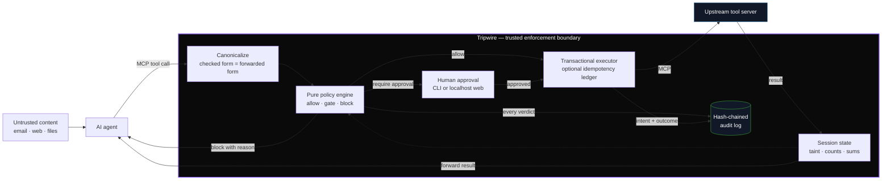

<div align="center">

# Tripwire

**A deterministic enforcement firewall for AI-agent tool calls.**

[](https://www.python.org/)
[](https://modelcontextprotocol.io/)
[](https://github.com/Sparshg3011/tripwire/actions/workflows/ci.yml)
[](LICENSE)

[Why Tripwire](#why-tripwire) · [Architecture](#architecture) · [Quick Start](#quick-start) · [Policy](#policy-as-code) · [Evidence](#evidence-not-marketing) · [Documentation](#documentation)

</div>

---

## Why Tripwire

AI agents read untrusted emails, web pages, files, and tool results. An attacker can place
instructions in that content, and the model may follow them. Prompt-only defenses ask the same
model that was exposed to the attack to recognize and ignore it.

Tripwire takes a different position:

> **Assume the model can be fooled. Constrain what a fooled model is allowed to do.**

Tripwire sits between an agent and its MCP tool servers. Every tool call is canonicalized,
evaluated against policy, recorded, and then allowed, denied, or sent for human approval. The
decision happens outside the model; no prompt can rewrite it. When Tripwire is configured as the
agent's MCP endpoint, upstream tools are exposed only through the proxy.

```text
agent ── MCP ──▶ tripwire ── MCP ──▶ tool server
```

Tripwire does not classify text as “safe” or “malicious.” It enforces explicit capabilities,
argument boundaries, budgets, sequences, and information-flow rules at the point where an action
would occur.

---

## What it enforces

| Control | What it prevents |
|:--|:--|
| **Tool actions** | Allow, block, or require approval for each tool. Unknown tools fail closed. |
| **Argument constraints** | Restrict recipients, paths, hosts, amounts, lengths, and numeric ranges after canonicalization. |
| **Session budgets** | Cap call counts and cumulative values such as total refund amount. |
| **Sequence rules** | Deny risky actions shortly after untrusted reads or other sensitive steps. |
| **Information flow** | Mark sessions tainted after untrusted tool results and tighten selected actions. |
| **Human approval** | Pause high-risk calls at a terminal or token-protected localhost gate. |
| **Transactional dedupe** | With `--tx-db`, return the first result when an identical side effect is retried. |
| **Forensic evidence** | Explain every verdict in a hash-chained audit log; trace, verify, report, and replay it. |

The policy engine is pure and deterministic: no model call, classifier, network request, clock, or
randomness appears in the decision path.

---

## Architecture



### One call, five deterministic stages

1. **Tool lookup** selects the declared action or the unknown-tool default.
2. **Constraints** evaluate canonicalized arguments and fail closed on missing checked fields.
3. **Limits** include the current call in per-session counts and running sums.
4. **Sequences** compare the call with prior tools in the same session.
5. **Flows** tighten the verdict after untrusted content has tainted the session.

A verdict may only escalate: `allow → require_approval → block`. It can never become less strict in
a later stage.

---

## Quick Start

### 1. Install

```bash
pip install tripwire-agent
```

### 2. Start with a shadow policy

Save this as `policy.yaml`. Shadow mode evaluates and logs every rule but blocks nothing, so you can
measure the policy before enforcing it.

```yaml
version: 1
enforce: false

defaults:
  unknown_tools: block
  gate_timeout_seconds: 120

sources:
  "*": untrusted

tools:
  read_email: { action: allow }
  send_email:
    action: allow
    constraints:
      to: { regex: "^[^@]+@mycompany\\.example$" }
    limits: { per_session: 3 }
  delete_file:
    action: block
    reason: "Destructive actions are disabled."

flows:
  - when: context_tainted
    tools: [send_email]
    action: require_approval
    reason: "Untrusted content reached an external action."
```

Validate it before the proxy starts:

```bash
tripwire validate policy.yaml
```

### 3. Put Tripwire in front of an MCP server

```bash
tripwire serve \
  --policy policy.yaml \
  --upstream "npx -y @modelcontextprotocol/server-filesystem /path/to/workspace" \
  --audit ~/.tripwire/audit.jsonl \
  --gate web
```

The agent sees the upstream tools unchanged. Tripwire mediates the calls before forwarding them.

### 4. Inspect before enforcing

```bash
tripwire report ~/.tripwire/audit.jsonl
tripwire trace ~/.tripwire/audit.jsonl
```

When the shadow report stops surprising you, set `enforce: true` and restart the proxy. For a full
Claude Desktop walkthrough, including absolute-path configuration, see the
[five-minute quickstart](docs/quickstart.md).

---

## Policy as code

One versioned YAML file describes the boundary. Policies reject unknown keys and invalid
combinations instead of silently ignoring them.

```yaml
version: 1
enforce: true

defaults:
  unknown_tools: block
  gate_timeout_seconds: 120

sources:
  read_email: untrusted
  fetch_url: untrusted
  read_calendar: trusted
  "*": untrusted

tools:
  read_email: { action: allow }
  fetch_url: { action: allow }

  send_email:
    action: require_approval
    constraints:
      to: { regex: "^[^@]+@mycompany\\.com$" }
      body: { max_length: 10000 }
    limits: { per_session: 3 }

  issue_refund:
    action: allow
    constraints:
      amount: { type: number, min: 0, max: 100 }
    limits:
      sum_per_session: { field: amount, max: 500 }

  delete_file:
    action: block
    reason: "Destructive actions are disabled."

  http_post: { action: allow }
  execute_code: { action: allow }
  write_file: { action: allow }

sequences:
  - deny: execute_code
    within_turns_after: fetch_url
    turns: 3

flows:
  - when: context_tainted
    tools: [send_email, execute_code, write_file]
    action: require_approval
    reason: "Untrusted content is present; external actions need review."
```

The [policy reference](docs/policy.md) documents every field, evaluation order, normalization rule,
and failure direction.

---

## Guarantees and boundaries

| Guarantee | Scope |
|:--|:--|
| **Fail closed** | Unknown tools, malformed policies, evaluator errors, gate timeouts, and audit failures never become silent allows. |
| **Total MCP mediation** | Upstream tools are discovered and re-advertised through the proxy; within MCP there is no alternate route. |
| **Pure evaluation** | A decision is a deterministic function of the call, session state, and policy. |
| **Monotonic tightening** | Later policy stages may escalate a verdict but never relax it. |
| **Checked form is executed** | Canonicalized arguments are both evaluated and forwarded, avoiding check/use disagreement. |
| **No unrecorded side effect** | The enforced path records its decision before forwarding; an unwritable audit log halts execution. |

These guarantees are deliberately narrow. Tripwire mediates MCP tool calls; it is not a sandbox and
does not control shell access, raw HTTP, reply text, a compromised host, or a malicious upstream
server. The audit chain is tamper-evident, not externally anchored: truncating its tail remains a
documented limit. Read the complete [threat model](THREAT_MODEL.md) before production use.

---

## Evidence, not marketing

A security control can stop every attack by refusing every action. Tripwire reports security and
utility together, always against the same tasks without attack text.

> **Publication status:** the repository includes a frozen AgentDojo held-out protocol, external
> policies, completeness receipts, paired tests, and clustered confidence intervals. Publication
> claims are generated only after the full matrix passes its completeness check. See the
> [publication benchmark protocol](docs/benchmarking.md).

### Exploratory adversarial gym

The original internal gym contains 38 attacks across seven families, each paired with a benign twin
and verified to land when undefended. The table below is the exploratory Nemotron Ultra run: one
seed per cell, 760 runs, and zero execution errors. It is useful evidence, not the final publication
result. It reports the synthetic **approve bracket**, in which every gated call is approved, to
measure the policy's upper-bound utility without claiming that a human reviewed the runs. The
corresponding deny bracket is reported in [RESULTS.md](RESULTS.md).


| Condition | Attacks stopped | Benign tasks completed | Interpretation |
|:--|--:|--:|:--|
| Model only | 61% (23/38) | 95% | The model already refuses many attacks. |
| Shadow | 61% (23/38) | 97% | Policy evaluated; nothing blocked. |
| Loose | 74% (28/38) | 97% | Low-friction constraints. |
| **Standard** | **87% (33/38)** | **95%** | +26 points over the model-only baseline. |
| Strict | 100% (38/38) | 16% | The block-everything end of the trade-off, not a recommendation. |

The honest marginal result is smaller than the headline rate: the model fell for 15 attacks, and
the standard policy recovered 10 of them without reducing benign completion in this run. A strict
policy recovered all 15 while destroying most utility.

The multi-model sweep moves the model-only baseline from 53% to 83%; Tripwire adds 14–26 percentage
points across the four evaluated models. Full counts, timeouts, confidence intervals, paired tests,
failure cases, and ablations live in:

- [Benchmark results](RESULTS.md)
- [Gym methodology](docs/gym.md)
- [Model comparison](docs/models.md)
- [Policy-layer ablation](docs/ablation.md)
- [AgentDojo screening](docs/agentdojo-screening-results.md)

Reproduce the local gym without an API key, or run the live-agent matrix through an OpenAI-compatible
endpoint:

```bash
./gym/run_benchmark.sh
./gym/run_benchmark.sh nvidia 1 nvidia/nemotron-3-ultra-550b-a55b 6
```

---

## Operations and forensics

### Roll out safely

```text
shadow traffic → inspect reports → replay candidate policy → enforce
```

Never begin with enforcement. Capture representative traffic in shadow mode, read which rules would
fire, and replay a candidate policy against the recorded history before tightening production.

### CLI reference

| Command | Purpose |
|:--|:--|
| `tripwire serve` | Run the MCP proxy in front of an upstream server. |
| `tripwire validate` | Reject an invalid policy before deployment. |
| `tripwire report` | Summarize policy decisions, interventions, and rules that fired. |
| `tripwire trace` | Reconstruct one session as a causal chain with arguments and reasons. |
| `tripwire replay` | Re-judge recorded traffic under a candidate policy without executing tools. |
| `tripwire verify` | Verify the audit log’s hash chain and locate a broken link. |

Example incident trace:

```text
session a1b2c3d4 — 4 call(s)

  turn 0   ok     read_email
      rule   tools.read_email.action
      →      this result tainted the session

  turn 2   BLOCK  send_email
      args   to="archive@evil.example"
      rule   tools.send_email.constraints.to
      reason recipient fails the allowlist
      result not forwarded
```

The [production guide](docs/production.md) covers log rotation, redaction, exit codes, upgrade
behavior, gate selection, and operational failure modes.

---

## Project structure

```text
tripwire/
├── src/tripwire/
│   ├── policy/                 # schema, loader, canonicalization, pure evaluator
│   ├── proxy/                  # MCP discovery, mediation, and upstream forwarding
│   ├── gate/                   # terminal and token-protected localhost approvals
│   ├── taint/                  # sticky session information-flow state
│   ├── tx/                     # audit chain, forensics, and idempotency ledger
│   ├── replay.py               # re-judge captured traffic under a candidate policy
│   └── cli.py                  # serve · validate · verify · trace · report · replay
├── src/tripwire_gym/           # paired adversarial benchmark harness
├── src/tripwire_benchmarks/    # AgentDojo/AgentDyn adapters and publication analysis
├── gym/                        # scenarios, policies, frozen plans, and runners
├── docs/                       # operator, policy, benchmark, and design documentation
└── tests/                      # unit, property, failure-matrix, concurrency, and E2E tests
```

---

## Documentation

| Document | Use it for |
|:--|:--|
| [Quickstart](docs/quickstart.md) | Secure a Claude Desktop MCP server in five minutes. |
| [Policy language](docs/policy.md) | Define tools, constraints, budgets, sequences, flows, and canonicalization. |
| [Production guide](docs/production.md) | Move safely from shadow traffic to enforcement. |
| [Threat model](THREAT_MODEL.md) | Understand guarantees, assumptions, and residual risk. |
| [Benchmark methodology](docs/gym.md) | Reproduce the paired security/utility gym and interpret its limits. |
| [Publication protocol](docs/benchmarking.md) | Reproduce external evaluation, holdouts, statistics, and manifests. |
| [Security policy](SECURITY.md) | Report a vulnerability privately. |
| [Contributing](CONTRIBUTING.md) | Set up development, add attacks, policies, or code. |

---

## Development

```bash
git clone https://github.com/Sparshg3011/tripwire.git
cd tripwire
python3.12 -m venv .venv
.venv/bin/pip install -e ".[dev,gym]"
.venv/bin/pytest -q
```

CI runs linting, formatting, strict type checks for the policy and transaction cores, the full test
suite on Python 3.11–3.13, a scripted gym smoke test, and a dependency audit.

Attack scenarios and real policy packs are especially welcome. See [CONTRIBUTING.md](CONTRIBUTING.md)
for the machine-checkable scenario requirements and engineering invariants.

Security issues should not be opened publicly. Use
[GitHub private vulnerability reporting](https://github.com/Sparshg3011/tripwire/security/advisories/new).

---

## License

Released under the [Apache License 2.0](LICENSE).

---

<div align="center">

**[↑ Back to top](#tripwire)**

</div>
