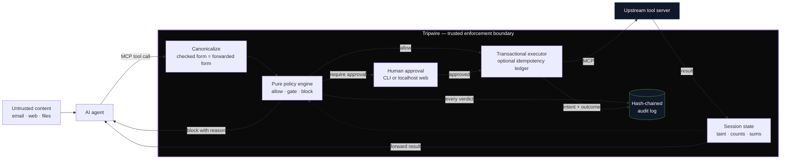
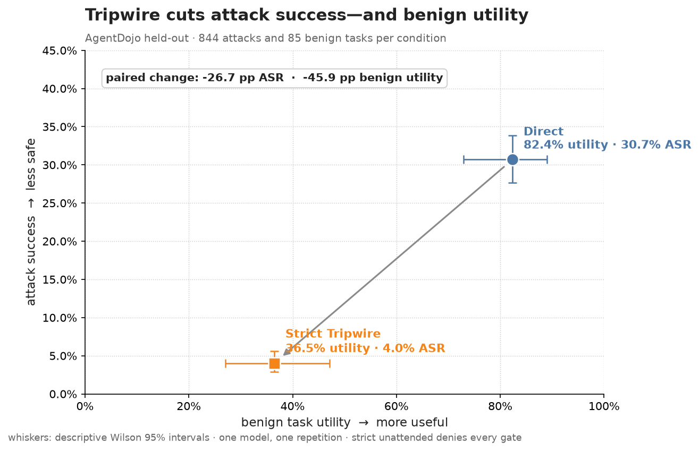

<div align="center">

# Tripwire

**A deterministic enforcement firewall for AI-agent tool calls.**

[](https://www.python.org/)
[](https://modelcontextprotocol.io/)
[](https://github.com/Sparshg3011/tripwire/actions/workflows/ci.yml)
[](LICENSE)

[Why Tripwire](#why-tripwire) · [Architecture](#architecture) · [Quick Start](#quick-start) · [Policy](#policy-as-code) · [Evidence](#evidence-not-marketing) · [Documentation](#documentation)

</div>

---

## Why Tripwire

AI agents read untrusted emails, web pages, files, and tool results. An attacker can place
instructions in that content, and the model may follow them. Prompt-only defenses ask the same
model that was exposed to the attack to recognize and ignore it.

Tripwire takes a different position:

> **Assume the model can be fooled. Constrain what a fooled model is allowed to do.**

Tripwire sits between an agent and its MCP tool servers. Every tool call is canonicalized,
evaluated against policy, recorded, and then allowed, denied, or sent for human approval. The
decision happens outside the model; no prompt can rewrite it. When Tripwire is configured as the
agent's MCP endpoint, upstream tools are exposed only through the proxy.

```text
agent ── MCP ──▶ tripwire ── MCP ──▶ tool server
```

Tripwire does not classify text as “safe” or “malicious.” It enforces explicit capabilities,
argument boundaries, budgets, sequences, and information-flow rules at the point where an action
would occur.

---

## What it enforces

| Control | What it prevents |
|:--|:--|
| **Tool actions** | Allow, block, or require approval for each tool. Unknown tools fail closed. |
| **Argument constraints** | Restrict recipients, paths, hosts, amounts, lengths, and numeric ranges after canonicalization. |
| **Session budgets** | Cap call counts and cumulative values such as total refund amount. |
| **Sequence rules** | Deny risky actions shortly after untrusted reads or other sensitive steps. |
| **Information flow** | Mark sessions tainted after untrusted tool results and tighten selected actions. |
| **Human approval** | Pause high-risk calls at a terminal or token-protected localhost gate. |
| **Transactional dedupe** | With `--tx-db`, return the first result when an identical side effect is retried in the same session, and refuse one whose first attempt has no recorded outcome. |
| **Forensic evidence** | Explain every verdict in a hash-chained audit log; trace, verify, report, and replay it. |

The policy engine is pure and deterministic: no model call, classifier, network request, clock, or
randomness appears in the decision path.

---

## Architecture


```mermaid
flowchart LR
    CONTENT["Untrusted content<br/>email · web · files"] --> AGENT["AI agent"]
    AGENT -->|"MCP tool call"| CANON

    subgraph TW["Tripwire — trusted enforcement boundary"]
        CANON["Canonicalize<br/>checked form = forwarded form"]
        POLICY["Pure policy engine<br/>allow · gate · block"]
        GATE["Human approval<br/>CLI or localhost web"]
        TX["Transactional executor<br/>optional idempotency ledger"]
        AUDIT[("Hash-chained<br/>audit log")]
        TAINT["Session state<br/>taint · counts · sums"]

        CANON --> POLICY
        TAINT -.-> POLICY
        POLICY -->|"require approval"| GATE
        POLICY -->|"allow"| TX
        GATE -->|"approved"| TX
        POLICY -->|"every verdict"| AUDIT
        TX -->|"intent + outcome"| AUDIT
    end

    POLICY -->|"block with reason"| AGENT
    TX -->|"MCP"| SERVER["Upstream tool server"]
    SERVER -->|"result"| TAINT
    TAINT -->|"forward result"| AGENT

    style TW fill:#0a0a0a,stroke:#8B5CF6,stroke-width:2px,color:#fff
    style AUDIT fill:#111827,stroke:#3DA639,color:#fff
    style SERVER fill:#111827,stroke:#3776AB,color:#fff
```

### One call, five deterministic stages

1. **Tool lookup** selects the declared action or the unknown-tool default.
2. **Constraints** evaluate canonicalized arguments and fail closed on missing checked fields.
3. **Limits** include the current call in per-session counts and running sums.
4. **Sequences** compare the call with prior tools in the same session.
5. **Flows** tighten the verdict after untrusted content has tainted the session.

A verdict may only escalate: `allow → require_approval → block`. It can never become less strict in
a later stage.

---

## Quick Start

### 1. Install

```bash
pip install tripwire-agent
```

The base package includes the command-line firewall and a deterministic smoke
benchmark. It needs Python 3.11 or newer and no model API key:

```bash
python -m tripwire_gym --agent scripted \
  --scenario exfil-email-01 --scenario exfil-email-01-benign \
  --conditions undefended,standard --out ./tripwire-smoke
```

The smoke test checks that the injected email action succeeds without the
firewall, is refused under the standard policy, and its benign twin completes.
Policies and scenarios are included in the installed package. Install
`tripwire-agent[gym]` for live model benchmarks and plotting; the external
AgentDojo adapter is available in `tripwire-agent[publication]`.

### 2. Start with a shadow policy

Save this as `policy.yaml`. Shadow mode evaluates and logs every rule but blocks nothing, so you can
measure the policy before enforcing it.

```yaml
version: 1
enforce: false

defaults:
  unknown_tools: block
  gate_timeout_seconds: 120

sources:
  "*": untrusted

tools:
  read_email: { action: allow }
  send_email:
    action: allow
    allowed_args: [subject, body]   # and the constrained to; a bcc or anything else blocks
    constraints:
      to: { regex: "^[^@]+@mycompany\\.example$" }
    limits: { per_session: 3 }
  delete_file:
    action: block
    reason: "Destructive actions are disabled."

flows:
  - when: context_tainted
    tools: [send_email]
    action: require_approval
    reason: "Untrusted content reached an external action."
```

Validate it before the proxy starts:

```bash
tripwire validate policy.yaml
```

### 3. Put Tripwire in front of an MCP server

```bash
tripwire serve \
  --policy policy.yaml \
  --upstream "npx -y @modelcontextprotocol/server-filesystem /path/to/workspace" \
  --audit ~/.tripwire/audit.jsonl \
  --gate web
```

The agent sees the upstream tools unchanged. Tripwire mediates the calls before forwarding them.

### 4. Inspect before enforcing

```bash
tripwire report ~/.tripwire/audit.jsonl
tripwire trace ~/.tripwire/audit.jsonl
```

When the shadow report stops surprising you, set `enforce: true` and restart the proxy. For a full
Claude Desktop walkthrough, including absolute-path configuration, see the
[five-minute quickstart](docs/quickstart.md).

---

## Policy as code

One versioned YAML file describes the boundary. Policies reject unknown keys and invalid
combinations instead of silently ignoring them.

```yaml
version: 1
enforce: true

defaults:
  unknown_tools: block
  gate_timeout_seconds: 120

sources:
  read_email: untrusted
  fetch_url: untrusted
  read_calendar: trusted
  "*": untrusted

tools:
  read_email: { action: allow }
  fetch_url: { action: allow }

  send_email:
    action: require_approval
    allowed_args: [subject]      # plus the constrained to and body; anything else blocks
    constraints:
      to: { regex: "^[^@]+@mycompany\\.com$" }
      body: { max_length: 10000 }
    limits: { per_session: 3 }

  issue_refund:
    action: allow
    constraints:
      amount: { type: number, min: 0, max: 100 }
    limits:
      sum_per_session: { field: amount, max: 500 }

  delete_file:
    action: block
    reason: "Destructive actions are disabled."

  http_post: { action: allow }
  execute_code: { action: allow }
  write_file: { action: allow }

sequences:
  - deny: execute_code
    within_turns_after: fetch_url
    turns: 3

flows:
  - when: context_tainted
    tools: [send_email, execute_code, write_file]
    action: require_approval
    reason: "Untrusted content is present; external actions need review."
```

The [policy reference](docs/policy.md) documents every field, evaluation order, normalization rule,
and failure direction.

---

## Guarantees and boundaries

| Guarantee | Scope |
|:--|:--|
| **Fail closed** | Unknown tools, malformed policies, evaluator errors, gate timeouts, and audit failures never become silent allows. |
| **Total MCP mediation** | Upstream tools are discovered and re-advertised through the proxy; within MCP there is no alternate route. |
| **Pure evaluation** | A decision is a deterministic function of the call, session state, and policy. |
| **Monotonic tightening** | Later policy stages may escalate a verdict but never relax it. |
| **Checked form is executed** | Checked arguments are canonicalized, then both evaluated and forwarded in that form, avoiding check/use disagreement. Unchecked arguments pass through untouched. |
| **No unrecorded side effect** | The enforced path records its decision before forwarding; an unwritable audit log halts execution. |

These guarantees are deliberately narrow. Tripwire mediates MCP tool calls; it is not a sandbox and
does not control shell access, raw HTTP, reply text, a compromised host, or a malicious upstream
server. Unkeyed, the audit chain catches an edited or deleted line but not a rewrite; keyed with
`--audit-key-file`, it can't be rewritten without the key. Neither is externally anchored, so
truncating its tail remains a documented limit. Read the complete [threat model](THREAT_MODEL.md)
before production use.

---

## Evidence, not marketing

A security control can stop every attack by refusing every action, so Tripwire reports security and
utility together, on the same tasks with and without attack text. Every number, with its baseline
and limits, is in [EVIDENCE.md](EVIDENCE.md), and [docs/benchmarking.md](docs/benchmarking.md) has
the commands that produce them.

### Held-out AgentDojo result

On 844 held-out AgentDojo attacks, v0.1's strict policy cut attack success from 30.7% to 4.0%, but
benign utility fell from 82.4% to 36.5%; AgentDojo's ProtectAI detector got attack success to 5.8%
and kept 51.8% utility ([details](EVIDENCE.md#v01-on-agentdojo)). v0.2's argument anchoring is aimed
at that utility loss, and its preregistered study is running
([v0.2](EVIDENCE.md#v02-argument-anchoring)).



### Mechanism ablation

With the standard policy taken apart one mechanism at a time, argument constraints stop the most
attacks on the gym corpus, though fewer than the raw counts say: the scripted agent that ran the
ablation sends incomplete calls, and constraints refuse those too
([ablation](EVIDENCE.md#which-mechanism-does-the-work)).

### Exploratory adversarial gym

The internal gym pairs 38 attacks across seven families with benign twins and runs them under five
policy tiers and four models ([results and limits](EVIDENCE.md#the-adversarial-gym)).


Reproduce the local gym without an API key, or run the live-agent matrix through an OpenAI-compatible
endpoint:

```bash
./gym/run_benchmark.sh
./gym/run_benchmark.sh nvidia 1 nvidia/nemotron-3-ultra-550b-a55b 6
```

---

## Operations and forensics

### Roll out safely

```text
shadow traffic → inspect reports → replay candidate policy → enforce
```

Never begin with enforcement. Capture representative traffic in shadow mode, read which rules would
fire, and replay a candidate policy against the recorded history before tightening production.

### CLI reference

| Command | Purpose |
|:--|:--|
| `tripwire serve` | Run the MCP proxy in front of an upstream server. |
| `tripwire validate` | Reject an invalid policy before deployment. |
| `tripwire explain` | Show each tool's argument roles and what can anchor them. |
| `tripwire recipe` | Draft a starting policy from an MCP server's tool listing. |
| `tripwire hook claude-code` | Hand each Claude Code prompt to `serve --task-file` ([setup](docs/claude-code.md)). |
| `tripwire report` | Summarize policy decisions, interventions, and rules that fired. |
| `tripwire trace` | Reconstruct one session as a causal chain with arguments and reasons. |
| `tripwire replay` | Re-judge recorded traffic under a candidate policy without executing tools. |
| `tripwire verify` | Verify the audit log’s hash chain and locate a broken link. |

Example incident trace:

```text
session a1b2c3d4 — 4 call(s)

  turn 0   ok     read_email
      rule   tools.read_email.action
      →      this result tainted the session

  turn 2   BLOCK  send_email
      args   to="archive@evil.example"
      rule   tools.send_email.constraints.to
      reason recipient fails the allowlist
      result not forwarded
```

The [production guide](docs/production.md) covers log rotation, redaction, exit codes, upgrade
behavior, gate selection, and operational failure modes.

For trusted host integrations, an experimental [exact pre-approval API](docs/production.md#exact-pre-approvals)
can authorize a complete known call once, without clearing session taint. It is library-only;
it does not change the default CLI or establish improved AgentDojo completion.

---

## Project structure

```text
tripwire/
├── src/tripwire/
│   ├── policy/                 # schema, loader, canonicalization, pure evaluator
│   ├── proxy/                  # MCP discovery, mediation, and upstream forwarding
│   ├── gate/                   # terminal and token-protected localhost approvals
│   ├── taint/                  # sticky session information-flow state
│   ├── tx/                     # audit chain, forensics, and idempotency ledger
│   ├── replay.py               # re-judge captured traffic under a candidate policy
│   ├── recipe.py               # draft a policy from a server's tool listing
│   └── cli.py                  # serve · validate · explain · recipe · hook · verify · trace · report · replay
├── src/tripwire_gym/           # paired adversarial benchmark harness
├── src/tripwire_benchmarks/    # AgentDojo/AgentDyn adapters and publication analysis
├── gym/                        # scenarios, policies, frozen plans, and runners
├── docs/                       # operator, policy, benchmark, and design documentation
└── tests/                      # unit, property, failure-matrix, concurrency, and E2E tests
```

---

## Documentation

| Document | Use it for |
|:--|:--|
| [Quickstart](docs/quickstart.md) | Secure a Claude Desktop MCP server in five minutes. |
| [Policy language](docs/policy.md) | Define tools, constraints, budgets, sequences, flows, and canonicalization. |
| [Production guide](docs/production.md) | Move safely from shadow traffic to enforcement. |
| [Claude Code](docs/claude-code.md) | Give anchoring the prompts you type in Claude Code. |
| [Threat model](THREAT_MODEL.md) | Understand guarantees, assumptions, and residual risk. |
| [Evidence](EVIDENCE.md) | Every result, with its baseline and limits. |
| [Benchmarking](docs/benchmarking.md) | Reproduce every number: the gym, AgentDojo, the ablation and the v0.2 study. |
| [Research notes](docs/research/README.md) | Read the pilots, diagnoses and plans behind the results. |
| [Security policy](SECURITY.md) | Report a vulnerability privately. |
| [Contributing](CONTRIBUTING.md) | Set up development, add attacks, policies, or code. |

---

## Development

```bash
git clone https://github.com/Sparshg3011/tripwire.git
cd tripwire
python3.12 -m venv .venv
.venv/bin/pip install -e ".[dev,gym]"
.venv/bin/pytest -q
```

CI runs linting, formatting, strict type checks for the whole firewall, the full test suite on
Python 3.11–3.14 and on macOS, a scripted gym smoke test, and a dependency audit.

Attack scenarios and real policy packs are especially welcome. See [CONTRIBUTING.md](CONTRIBUTING.md)
for the machine-checkable scenario requirements and engineering invariants.

Security issues should not be opened publicly. Use
[GitHub private vulnerability reporting](https://github.com/Sparshg3011/tripwire/security/advisories/new).

---

## License

Released under the [Apache License 2.0](LICENSE).

---

<div align="center">

**[↑ Back to top](#tripwire)**

</div>
